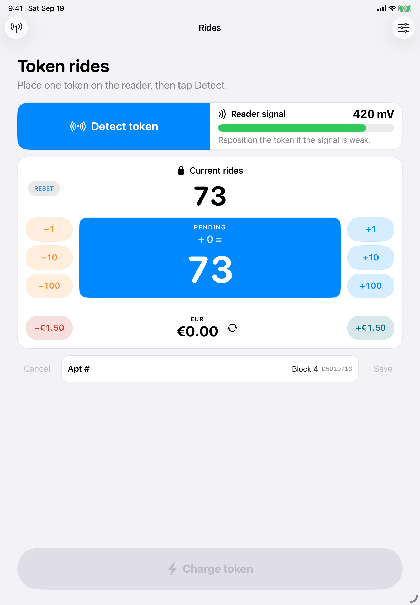
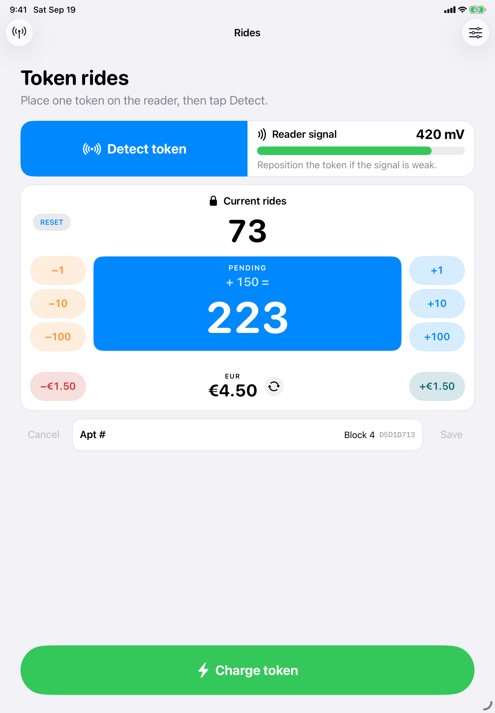
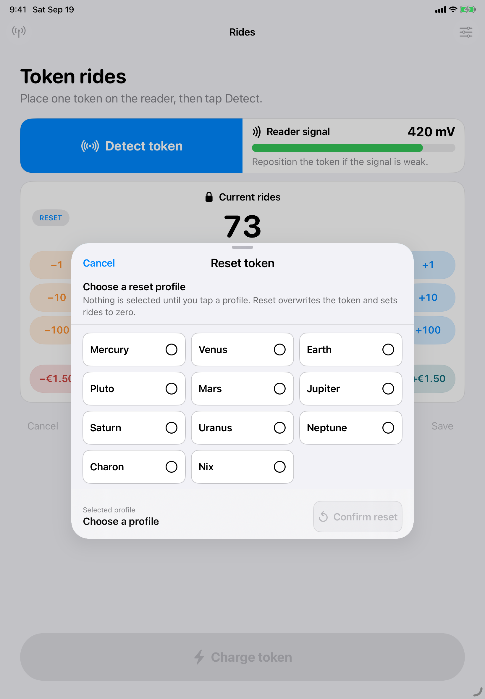
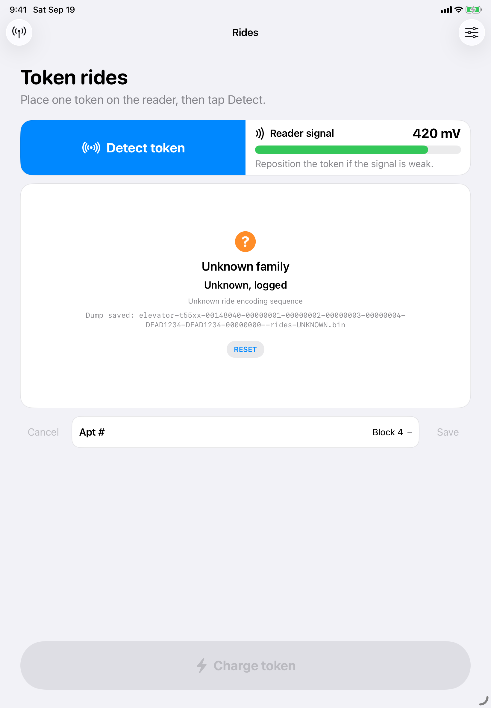
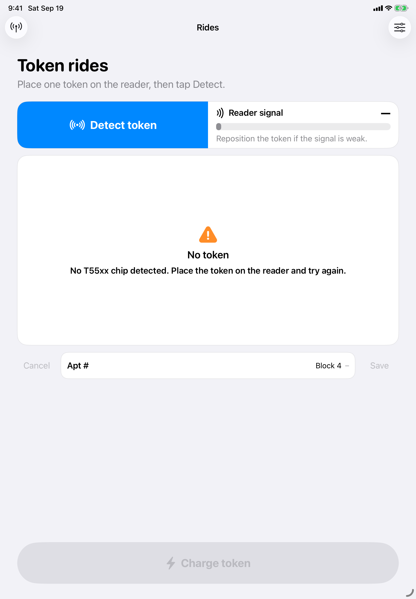

# RidesTablet

An iPad-only SwiftUI operator app for non-technical token operators. It targets iPad Air 4 and runs **Concept A** as the normal workflow: pair to a Mac `RidesBridge` over local Wi‑Fi/hotspot, then Detect / Charge / Reset through `NetworkRideTokenDevice`. A DEBUG-only fake reader keeps `FakeProxmark` available for deterministic UI work and simulator screenshots without a Mac or PM3.

## Operator flow

1. On first launch, complete bridge pairing (QR scan or manual URL + PIN) in the connection gate; later launches reconnect automatically when safe.
2. Put a token on the reader and tap **Detect token**. Detect, tune, and read run as one flow. Signal is shown in millivolts so the token can be repositioned.
3. On a known read, the merged panel shows Current rides, the noneditable **PENDING** total, and EUR. The three minus controls on the left and plus controls on the right adjust pending rides by 1, 10, and 100; values stay within 0–500.
4. The blue PENDING card shows a muted live equation: the signed delta followed by `=` (for example, `+ 150 =`; decreases use `− 20 =`). The change is priced at €0.03 per ride. EUR is adjusted with the aligned `−€1.50` and `+€1.50` buttons; the round control on the EUR row rounds the signed delta to the nearest 50 rides (€1.50), with midpoints away from zero.
5. Tap **Charge token** only after a known token has changed. A successful write makes pending the new current count.
6. `RESET` is in the merged panel for known and unknown tokens and requires an explicit profile selection. The confirmation button is disabled until a profile is selected. Idle, working, no-chip, and failure states replace the controls with centered status content; unknown saves report `Unknown, logged`, while log failures remain errors.

The compact Apt # control row keeps disabled Cancel on the left and disabled Save on the right, with the read-only Block 4 value in the middle. Portrait uses the seamless Detect/signal strip, centered Current → PENDING → EUR controls, Apt row, and large Charge action. Landscape switches to a two-column reader/Apt and count/status layout, with Charge pinned below the right column.

Connection diagnostics (Bonjour browse, manual URL, block-5 connectivity probe) live in the settings sheet and do not duplicate Concept A business logic.

## Screenshots (Concept A, iPad Air 4 simulator)

The images below were captured on the **RidesTablet iPad Air 4** simulator using the DEBUG `FakeProxmark` path (`RIDES_SIMULATOR_FAKE_READER=1`). They show current Concept A operator UI, not the older diagnostic-only root or physical PM3 hardware.

| Scene | Caption |
| --- | --- |
|  | Known Mercury token after Detect — current rides, pending (unchanged), EUR, and reader signal. |
|  | Pending rides increased by 150 (`+ 150 =`) with matching EUR delta. |
|  | Reset sheet — profile grid with no selection until the operator taps one. |
|  | Unknown family after Detect — `Unknown, logged` and dump filename. |
|  | No-chip status when nothing is on the reader. |

### Simulator screenshot launch (DEBUG only)

For repeatable captures without tapping through the connection gate:

```sh
# Boot the agreed simulator (UDID from `xcrun simctl list`)
xcrun simctl boot "RidesTablet iPad Air 4"

# Build Debug, install, then launch with FakeProxmark auto-enabled.
# Use SIMCTL_CHILD_ prefix so simctl passes env vars into the app process.
SIMCTL_CHILD_RIDES_SIMULATOR_FAKE_READER=1 \
SIMCTL_CHILD_RIDES_SCREENSHOT_SCENE=known \
  xcrun simctl launch --terminate-running-process <UDID> com.example.RidesTablet
```

`RIDES_SCREENSHOT_SCENE` accepts `known`, `pending`, `reset`, `unknown`, and `no-chip` (alias `nochip`). Each scene runs Detect (and opens the reset sheet or adjusts pending where needed) before you capture with `xcrun simctl io <UDID> screenshot path.png`.

## Simulation scenarios (DEBUG fake reader only)

When the DEBUG fake reader is enabled, the top-right slider menu offers: Good token, Weak signal, No chip, Unknown family, and Write failure. Unknown family reports exactly `Unknown, logged` only after the page-0 dump saves successfully. If logging fails, it reports `Unknown token — log failed` with the save error. No chip reports exactly `No T55xx chip detected. Place the token on the reader and try again.`

Unknown page-0 images are written as 32-byte big-endian `.bin` files under the app's `Library/Application Support/RidesTablet/UnknownDumps` directory.

## Build and test

From the repository root, run the full XCTest suite:

```sh
xcodebuild test \
  -project RidesTablet/RidesTablet.xcodeproj \
  -scheme RidesTablet \
  -destination 'platform=iOS Simulator,name=RidesTablet iPad Air 4'
```

For a local UI review, launch the app on the same iPad Air (4th generation) simulator. Use the DEBUG fake reader (`RIDES_SIMULATOR_FAKE_READER=1` or the in-app **Use simulator fake reader** button) for offline UI work, or run `RidesBridge` on a Mac (`dotnet run --project RidesBridge/RidesBridge.csproj -- --fake-pm3`) for network integration testing.
